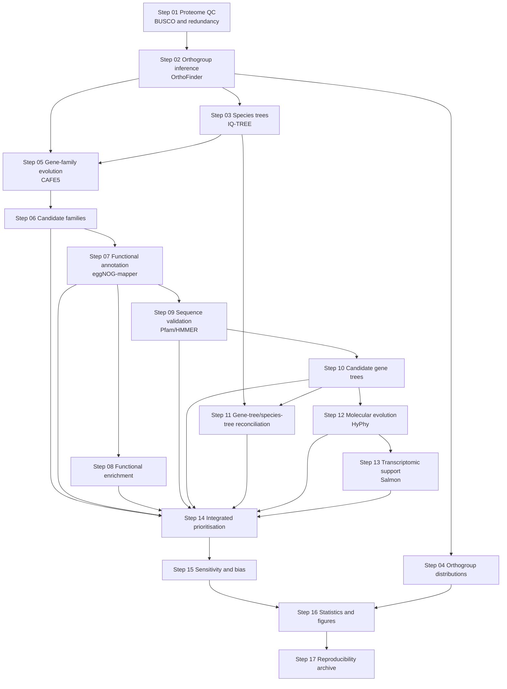

# Mollusc symbiosis comparative-genomics pipeline

This repository is the final, security-screened and path-sanitised script export for a comparative-genomics project that contrasts symbiotic/kleptoplastic and non-symbiotic molluscs within Bivalvia and Gastropoda. It reconstructs the analysis from proteome quality control through orthogroup inference, phylogenomics, gene-family evolution, functional interpretation, candidate validation, molecular evolution, transcriptomic support, integrated ranking, sensitivity analysis, visualisation and final archiving.

The scripts were exported from the validated Step 17 reproducibility archive created on 16 August 2026. The repository contains 74 scripts and the final audit metadata. Analysis logic, parameters and file relationships are retained, while user-specific project/home paths, the cluster username and the Slurm account have been replaced with explicit generic placeholders. It deliberately excludes passwords, SSH keys, tokens, raw reads, primary genome/proteome files, databases, Conda environments and large reconstructible OrthoFinder working directories.

## Study design

The final core dataset contains 14 species and is analysed primarily within class to reduce deep-divergence and annotation-comparability bias.

| Class | Focal symbiotic or kleptoplastic species | Non-symbiotic comparison species |
|---|---|---|
| Bivalvia | *Fragum sueziense*, *Tridacna gigas*, *Tridacna maxima* | *Acanthocardia echinata*, *Americardia media*, *Cerastoderma edule* |
| Gastropoda | *Elysia chlorotica*, *Elysia crispata*, *Elysia marginata*, *Plakobranchus ocellatus* | *Aplysia californica*, *Berghia stephanieae*, *Bullacta exarata*, *Onchidella celtica* |

The combined 14-species analysis is retained as a phylogenetic baseline. *Fragum fragum* was replaced by *Fragum sueziense* because the latter had a paired, downloadable genome and protein annotation and met the project quality requirements.

## Repository contents

- `scripts/` — the final Step 17 script set, with editor swap files removed and personal paths/accounts sanitised.
- `docs/RUN_ORDER.zh-CN.md` — complete ordered execution guide, including the purpose, inputs, tools, dependencies, commands and outputs for every step.
- `docs/SCRIPT_STATUS.md` — identifies authoritative entry points, helper scripts and superseded IQ-TREE entry points.
- `docs/PORTABILITY_AND_SECURITY.md` — BluePebble-specific paths, data policy, security notes and portability requirements.
- `metadata/` — sanitised final-run selection, data lineage, software/database versions, Slurm ledger, checksums, limitations, archive validation and sanitisation records.

## Workflow overview



## Quick start on BluePebble

These are project-specific analysis scripts rather than a generic software package. Before submitting anything, replace `/path/to/mollusc_project`, `/path/to/miniconda3` and `YOUR_SLURM_ACCOUNT` with values authorised for the target cluster, then read the portability notes.

```bash
cd /path/to/mollusc_project
mkdir -p scripts logs
cp /path/to/this/repository/scripts/* scripts/
chmod u+x scripts/*
```

Then follow [the ordered Chinese run guide](docs/RUN_ORDER.zh-CN.md). Do not run all files alphabetically: several files are Python/R workers, several are Slurm jobs, and a few are environment/validation helpers rather than pipeline entry points.

## Authoritative final-analysis choices

- Core proteomes: BUSCO complete score at least 80%.
- Taxonomic structure: Bivalvia (6 species) and Gastropoda (8 species) analysed separately; a combined 14-species tree is retained as a baseline.
- Species trees: IQ-TREE with restricted ModelFinder for the combined and Gastropoda final trees, 1,000 ultrafast bootstrap replicates and 1,000 SH-aLRT replicates. The Bivalvia final tree is the completed class-specific MFP run.
- Gene-family evolution: CAFE5 with relative root age 100; this is an exploratory relative-time screen, not an absolute divergence-time analysis. Gastropoda Base-model results are primary because the Gamma-model diagnostic was unreliable.
- Functional evidence: transferred eggNOG annotation is kept separate from direct Pfam/HMMER evidence.
- Transcriptomics: one selected library per represented species; expression is detection/support evidence only, with no differential-expression test or direct cross-species TPM comparison.
- Integrated scores: evidence-weighted rankings, not probabilities; missing RNA-seq or HyPhy evidence is not treated as biological absence.
- Final sensitivity result: Step 15 run `18431248`; historical run `18428504` is not authoritative.

The complete authoritative paths are recorded in `metadata/FINAL_RUN_SELECTION.tsv`, and material interpretation limits are recorded in `metadata/FINAL_METHODS_AND_LIMITATIONS.md` and `metadata/ANALYSIS_DECISIONS.tsv`.

## Reproducibility and security

The original Step 17 security scan reports no credential-risk matches in selected scripts. Before this GitHub export, every occurrence of the user-specific BluePebble project/home path, username and Slurm account was replaced, and a second scan found no retained personal identifiers or high-risk credential values. The transformation is recorded in `metadata/SANITIZATION_REPORT.tsv`. The repository remains private as an additional precaution.

Source archive SHA-256:

```text
ef3cb405f7ab981ddb263db04e06bab59bb7fc2829fb93f40bb095822e439e90
```
